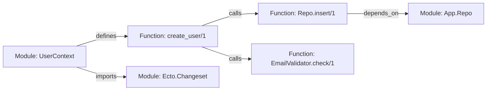

# Ragex: Complete Technical Feature Reference & Architecture Manual

> **Version**: 0.29.0  
> **Ecosystem**: Elixir (~> 1.18), Erlang/OTP 27+, MCP (Model Context Protocol)  
> **Package**: Published on [hex.pm/packages/ragex](https://hex.pm/packages/ragex)  
> **Source Code**: [github.com/Oeditus/ragex](https://github.com/Oeditus/ragex)

---

## Table of Contents
1. [Executive Summary & Core Philosophy](#1-executive-summary--core-philosophy)
2. [Multi-Language AST Parsing & Code Analyzers](#2-multi-language-ast-parsing--code-analyzers)
3. [Knowledge Graph Engine & Storage Backends](#3-knowledge-graph-engine--storage-backends)
4. [Local ML Vector Search & Neural Embeddings](#4-local-ml-vector-search--neural-embeddings)
5. [Hybrid Retrieval System & MetaAST Ranking](#5-hybrid-retrieval-system--metaast-ranking)
6. [Multi-Provider RAG Engine & Response Caching](#6-multi-provider-rag-engine--response-caching)
7. [Code Editing, Safety & Semantic AST Refactoring](#7-code-editing-safety--semantic-ast-refactoring)
8. [Code Quality, Business Logic & Security Audit](#8-code-quality-business-logic--security-audit)
9. [Model Context Protocol (MCP) Server Infrastructure](#9-model-context-protocol-mcp-server-infrastructure)
10. [Interactive CLI Suite & Developer Workflows](#10-interactive-cli-suite--developer-workflows)
11. [REST API Bridge & Editor Integration Ecosystem](#11-rest-api-bridge--editor-integration-ecosystem)

---

## 1. Executive Summary & Core Philosophy

**Ragex** is an enterprise-grade **Hybrid Retrieval-Augmented Generation (RAG)** system, **Model Context Protocol (MCP)** server, and **code understanding / refactoring engine** built natively in Elixir.

Unlike traditional AI code search tools that rely exclusively on coarse text-chunk vector embeddings or surface-level `grep`, Ragex operates at the intersection of **symbolic static analysis (Compiler ASTs & Knowledge Graphs)**, **dense vector space representations (Local Neural Embeddings)**, and **semantic code transformation engines**.

```
                           ┌────────────────────────────────────────────────────────┐
                           │                     Ragex Engine                       │
                           └───────────────────────────┬────────────────────────────┘
                                                       │
         ┌─────────────────────────────────────────────┼─────────────────────────────────────────────┐
         ▼                                             ▼                                             ▼
┌─────────────────────────┐               ┌─────────────────────────┐               ┌─────────────────────────┐
│   Symbolic Knowledge    │               │  Neural Vector Embed    │               │  Semantic AST Refactor  │
│  • Compiler AST Parsing │               │  • Local Bumblebee ML   │               │  • Multi-file Atomic    │
│  • Multi-Language SCIP  │  ───────────► │  • 384d Dense Space     │  ───────────► │  • Syntax Pre-Check     │
│  • Entity Call Graphs   │               │  • k-NN Sub-50ms Search │               │  • Instant Rollbacks    │
│  • Graph Centralities   │               │  • SHA256 Track Cache   │               │  • AI Safety Preview    │
└─────────────────────────┘               └─────────────────────────┘               └─────────────────────────┘
         │                                             │                                             │
         └─────────────────────────────────────────────┼─────────────────────────────────────────────┘
                                                       ▼
                                     ┌───────────────────────────────────┐
                                     │   Reciprocal Rank Fusion (RRF)    │
                                     │     Sub-100ms Hybrid Search       │
                                     └───────────────────────────────────┘
```

### Key Pillars & Philosophical Directives
1. **Local-First & Zero Vendor Lock-in**: Codebases contain core IP. Embeddings and knowledge graphs run 100% locally on standard host hardware using native Elixir/Erlang concurrency without sending raw source code to third-party vector databases.
2. **Deterministic Precision Meets Neural Intuition**: Vector search provides natural language retrieval ("where do we validate JWT tokens?"), while the Knowledge Graph ensures mathematical precision for call sites, dependencies, and circular references.
3. **Safety-Guaranteed Execution**: Code editing and automated refactorings feature pre-execution syntax validation, atomic file transactions, SHA256 integrity checks, auto-formatting, and multi-version rollback capabilities.
4. **Complete Harness Control**: Developers control AI provider selection (OpenAI, Anthropic, DeepSeek-R1, local Ollama), context construction limits, system prompts, cache TTLs, cost management, and tool execution scope.

---

## 2. Multi-Language AST Parsing & Code Analyzers

Ragex extracts structural symbols (modules, functions, arities, types, macros, dependencies, and imports) directly from source code using language-native parsers and compiler infrastructure.

### Supported Language Analyzers

| Language | Primary Parsing Mechanism | Extracted Entities & Metadata | Fallback Strategy |
| :--- | :--- | :--- | :--- |
| **Elixir** (`.ex`, `.exs`) | Native `Code.string_to_quoted/2` + Macro AST Traversal | Modules, `def`/`defp`/`defmacro`, call graphs, arity, line numbers, `@doc`, `@spec`, aliases, imports, uses | Native AST parsing |
| **Erlang** (`.erl`, `.hrl`) | Native `:erl_scan` + `:erl_parse` | Modules, functions, exports, attributes, specs, records, macro defines, function calls | Erlang abstract format |
| **Python** (`.py`) | Subprocess execution of Python's built-in `ast` module | Classes, functions, methods, decorators, imports, async functions, docstrings, line ranges | Regex structure extraction |
| **Ruby** (`.rb`) | Metastatic Ruby Parser Adapter (`parser` gem) | Classes, modules, methods (`def`/`defs`), blocks, requires, includes, line numbers | Native regex fallback |
| **JavaScript / TypeScript** (`.js`, `.jsx`, `.ts`, `.tsx`, `.mjs`) | Node.js AST parser bridge / Regex structural parser | Functions, arrow functions, classes, methods, ES6/CommonJS exports, imports, require calls | Regex pattern matching |
| **SCIP Protocol** (Multi-Language) | LSIF/SCIP Indexer Bridge (`scip-clang`, `scip-go`, `scip-python`, `scip-typescript`, `scip-java`) | Global symbol definitions, references, cross-file symbol call graphs across 10+ languages | AST Analyzers |
| **Universal MetaAST** (Metastatic) | `Metastatic` Intermediate AST Representation | Canonical AST trees across Elixir, Erlang, Python, Ruby, and Haskell for cross-language search | Language AST |

### Advanced Indexing Features
- **Incremental SHA256 File Tracking**: Computes SHA256 hashes for every file. Modifying 1 file in a 10,000-file repository re-indexes *only* that single file (<5% graph regeneration overhead).
- **Parallel Directory Scanning**: Processes multi-directory structures concurrently using Elixir's `Task.async_stream`, indexing up to 100+ files per second.
- **Automated Re-indexing (File Watcher)**: Built-in `Ragex.Watcher` monitors file system changes via `file_system` and updates both the Knowledge Graph and Vector Store in real time.

---

## 3. Knowledge Graph Engine & Storage Backends

The Ragex Knowledge Graph models codebases as directed, weighted multigraphs stored in memory or persisted across sessions.



### Entity Nodes & Relationship Edges

#### Graph Nodes (`Ragex.Graph.Store`)
- `:module` — Module or Class definition with namespace, file path, line bounds, and documentation.
- `:function` — Function definition with name, arity, public/private visibility, parameters, and location.
- `:type` — Struct, record, type definition, or interface.
- `:attribute` — Module attributes (`@doc`, `@spec`, `@vsn`).
- `:file` — Source file metadata and SHA256 hash.

#### Graph Edges
- `:calls` — Call relationship from function A to function B (weighted by call frequency).
- `:defines` — Parent-child ownership (e.g., Module defines Function).
- `:imports` / `:uses` / `:requires` — Module usage directives.
- `:depends_on` — Inter-module dependency relationship.

### Graph Storage Backends

#### 1. In-Memory ETS Backend (`Ragex.Store.Backend.ETS`)
High-performance Erlang Term Storage tables optimized for read-heavy query patterns. Provides sub-millisecond graph traversals.

#### 2. Persistent `dllb` Multi-Model Database Backend (`Ragex.Store.Backend.Dllb`)
Integrates with [`dllb`](https://github.com/Oeditus/dllb)—a Rust-based multi-model database server.
- **Per-Project Process Supervision**: Ragex automatically spawns and manages a dedicated `dllb-server` daemon per project workspace.
- **HNSW Vector Indexing**: Accelerated high-dimensional vector search.
- **BM25 Full-Text Search**: Full-text indexing of code comments, documentation, and identifiers powered by Tantivy.
- **Zero Cold-Boot Overhead**: Instant graph and vector index loading without re-parsing files upon application restart.

### Advanced Graph Algorithms (`Ragex.Graph.Algorithms`)

Ragex implements classic and modern graph theory algorithms directly on code graphs:

```elixir
# Calculate PageRank score for module importance
{:ok, ranks} = Ragex.Graph.Algorithms.page_rank(store, damping_factor: 0.85)

# Discover structural call paths between functions
{:ok, paths} = Ragex.Graph.Algorithms.find_paths(store, start_node, target_node, max_depth: 5, max_paths: 100)

# Compute centralities to spot code bottlenecks
{:ok, betweenness} = Ragex.Graph.Algorithms.betweenness_centrality(store, normalized: true)
{:ok, closeness} = Ragex.Graph.Algorithms.closeness_centrality(store, normalized: true)

# Detect architectural modules/communities via Louvain method
{:ok, communities} = Ragex.Graph.Algorithms.detect_communities(store, algorithm: :louvain)
```

- **PageRank**: Computes importance scores for all modules/functions based on caller density.
- **DFS Path Finding**: Discovers call chains between any two entities, featuring early stopping (`max_paths`) and dense-graph protection to prevent exponential path explosion.
- **Betweenness Centrality (Brandes' Algorithm)**: Identifies architectural "bridge" functions that connect disparate subsystems.
- **Closeness Centrality**: Measures how close a function is to all other functions in the codebase graph.
- **Community Detection (Louvain & Label Propagation)**: Groups functions into logical architectural clusters based on edge weight modularity optimization.
- **Graph Visualization Export**: Exports graph topology to **Graphviz DOT** or **D3.js JSON** format, with nodes colored by centrality and edge thickness proportional to call frequency.

---

## 4. Local ML Vector Search & Neural Embeddings

Ragex includes a complete, locally executed machine learning embedding pipeline that transforms code snippets and natural language descriptions into 384-dimensional dense vectors.

```
Code Symbol / Description ──► Local Bumblebee Transformer ──► 384d Float Array ──► Vector Store Index
                               (sentence-transformers/
                                all-MiniLM-L6-v2)
```

### ML Architecture & Models
- **Native Execution Engine**: Built on Elixir's `Bumblebee`, `Nx`, and `EXLA` (NIF-accelerated).
- **Default Embedding Model**: `sentence-transformers/all-MiniLM-L6-v2` (384 dimensions, ~90MB download size, cached locally at `~/.cache/huggingface/`).
- **Zero API Dependency**: Inference runs 100% locally on standard CPU/GPU without cloud service calls.
- **Model Registry & Dynamic Switching**: Switch between models dynamically (`mix ragex.embeddings.migrate`) with automatic vector space compatibility validation.

### Vector Search Engine (`Ragex.VectorStore`)
- **Cosine Similarity Search**: Computes dot products across normalized vectors. Performs k-NN search across 1,000+ entities in **<50ms**.
- **Concurrent Vector Calculation**: Uses parallel matrix multiplication for rapid batched queries.
- **Filtered k-NN Queries**: Filter similarity results by node type (`:function`, `:module`), similarity threshold (`min_score`), and max limit (`limit`).

### Persistence & Caching (`Ragex.Embeddings.Persistence`)
- **Automatic Disk Serialization**: Saves computed vectors to binary cache files upon shutdown and restores them on boot.
- **Cold Boot Speedup**: Reduces cold start startup time from ~50s (full re-embedding) to **<5s**.
- **Project Isolation**: Unique cache keying prevents vector collisions across different project directories.

---

## 5. Hybrid Retrieval System & MetaAST Ranking

Single-mode search strategies fail on complex codebases: semantic search misses exact function arities or call hierarchies, while keyword search misses conceptual queries. Ragex unifies both into a **Hybrid Retrieval Engine**.

```
User Query: "Where do we validate email and format user input?"
   │
   ├─► Vector k-NN Search (Bumblebee) ───────────► Top 50 Vector Matches  ─────┐
   │                                                                           │
   └─► Symbolic Graph Query (PageRank/Calls) ────► Top 50 Graph Matches   ─────┼─► Reciprocal Rank Fusion (RRF k=60)
                                                                               │    Final Rank Boosted by MetaAST Engine
   ┌─► MetaAST Pattern Matcher & Ranker ────────► Purity & Complexity Scores ──┘
```

### Search Fusion Strategies (`Ragex.Retrieval.Hybrid`)
1. **Reciprocal Rank Fusion (RRF, default `k=60`)**: Merges separate ranked lists from neural vector search and graph centrality scoring using the formula:
   \[
   RRF\_Score(d) = \sum_{m \in M} \frac{1}{k + r_m(d)}
   \]
2. **Semantic-First Strategy**: Executes high-recall vector search first, then filters candidates against graph topological constraints.
3. **Graph-First Strategy**: Traverses structural graph call chains first, then ranks candidates by vector similarity to the prompt.

### MetaAST-Enhanced Retrieval & Intent Analysis (`Ragex.Retrieval.MetaASTRanker`)
- **Query Intent Detection**: Automatically detects query intent (`:explain`, `:refactor`, `:example`, `:debug`) and adjusts ranking weights.
- **Function Purity Analysis**: Boosts side-effect-free pure functions for explanation queries.
- **Complexity-Aware Scoring**: Ranks simpler functions higher when generating usage examples, and more complex functions higher for refactoring prompts.
- **Cross-Language Query Expansion**: Expands search terms with cross-language synonyms (e.g., matching Elixir `Enum.map` with Python list comprehensions).
- **Pattern Match Retrieval**: Executes AST pattern searches across indexed codebases (`find_metaast_pattern`).

---

## 6. Multi-Provider RAG Engine & Response Caching

Ragex integrates a complete Retrieval-Augmented Generation pipeline capable of consuming hybrid search contexts and generating contextual answers, explanations, and refactoring strategies.

### Supported AI Providers (`Ragex.AI.Registry`)

```elixir
# Switch providers per query or globally
config :ragex, :ai,
  provider: :deepseek_r1,
  api_key: System.get_env("DEEPSEEK_API_KEY")
```

- **DeepSeek R1**: Full reasoning model support (`deepseek-reasoner` and `deepseek-chat`).
- **OpenAI**: GPT-4o, GPT-4-turbo, GPT-3.5-turbo models.
- **Anthropic**: Claude 3.5 Sonnet, Claude 3 Opus, Claude 3 Haiku models.
- **Ollama (Local LLM)**: 100% offline local inference (e.g., `llama3`, `mistral`, `codellama`, `qwen2.5-coder`).

### Core RAG Engine Capabilities
- **Streaming Response Architecture**: Supports real-time Server-Sent Events (SSE) and NDJSON streaming (`rag_query_stream`, `rag_explain_stream`, `rag_suggest_stream`).
- **Context Compaction & Windowing**: Formats knowledge graph relationships, call sites, and file contents into compact prompt context blocks (up to 8,000 tokens) with strict token budget enforcement.
- **ETS-Based Response Cache (`Ragex.AI.Cache`)**: Caches LLM response generations using SHA256 context hashing with configurable TTLs (3-7 days) and LRU eviction, achieving **>50% cache hit rates** for repeated queries.
- **Usage & Cost Tracking (`Ragex.AI.Usage`)**: Real-time tracking of API token metrics, request volumes, and estimated financial costs per provider with windowed rate-limiting enforcement.

---

## 7. Code Editing, Safety & Semantic AST Refactoring

Modifying source code with AI requires strict safety guarantees. Ragex provides an **AST-aware Code Editing & Refactoring Engine** equipped with multi-file transaction safety and instant rollbacks.

```
                               ┌───────────────────────────────────┐
                               │   Refactoring Request             │
                               │   (e.g., rename_function)         │
                               └─────────────────┬─────────────────┘
                                                 │
                                                 ▼
                               ┌───────────────────────────────────┐
                               │   Graph Dependency Discovery      │
                               │   Finds all call sites & files    │
                               └─────────────────┬─────────────────┘
                                                 │
                                                 ▼
                               ┌───────────────────────────────────┐
                               │   Transaction Pre-Validation      │
                               │   Language Syntax Check (AST)     │
                               └─────────────────┬─────────────────┘
                                                 │
                                        ┌────────┴────────┐
                                    PASS│                 │FAIL
                                        ▼                 ▼
                       ┌──────────────────────────┐    ┌──────────────────────────┐
                       │ Apply Edits Atomically   │    │ Abort Transaction        │
                       │ Create ZIP/Disk Backup   │    │ Zero File System Changes │
                       │ Format (mix, black, etc) │    └──────────────────────────┘
                       └──────────────────────────┘
```

### Safety Infrastructure (`Ragex.Editor`)
- **Atomic Operations (`Ragex.Editor.Core`)**: File writes are executed atomically. Concurrent file modification detectors prevent race conditions.
- **Multi-File Transactions (`Ragex.Editor.Transaction`)**: Executes cross-file changes inside atomic transactions. If syntax validation fails on file 4 out of 5, all previous edits are automatically rolled back.
- **Backup & Rollback System (`Ragex.Editor.Backup`)**: Creates compressed, timestamped file backups in `.ragex/backups/` before any edit. Any edit can be immediately undone using `rollback_edit`.
- **Language-Native Syntax Validators (`Ragex.Editor.Validator`)**:
  - Elixir: `Code.string_to_quoted/2` syntax parsing
  - Erlang: `:erl_scan` + `:erl_parse` validation
  - Python: `ast.parse()` validation via subprocess
  - Ruby: `ruby -c` syntax verification
  - JavaScript/TypeScript: Node.js `vm.Script` syntax compilation
- **Auto-Formatting Integration (`Ragex.Editor.Formatter`)**: Automatically invokes language formatters (`mix format`, `rebar3 fmt`, `black`, `rubocop`, `prettier`) after successful edits.

### AST Semantic Refactorings (`Ragex.Editor.Refactor`)

| Operation Name | Scope | Mechanism | Description |
| :--- | :--- | :--- | :--- |
| `rename_function` | Project-wide | AST Parsing + Graph | Renames function definition and updates all call sites, qualified calls (`Module.func`), and function references (`&func/arity`) while preserving arity. |
| `rename_module` | Project-wide | AST Parsing + Graph | Renames module definition, updates imports, aliases, qualified references, and module attributes across the entire codebase. |
| `extract_function` | File-scoped | AST Manipulation | Extracts a code block into a new function definition and replaces original block with function invocation. |
| `inline_function` | Project-wide | AST Manipulation | Replaces all calls to a target function with its body expression and removes definition. |
| `convert_visibility` | File-scoped | AST Manipulation | Toggles function visibility between public (`def`) and private (`defp`) / Erlang exports. |
| `rename_parameter` | Function-scoped | AST Scope Analysis | Renames function parameters across definition clause heads and internal function body references. |
| `modify_attributes` | File-scoped | AST Manipulation | Adds, updates, or removes module attributes (`@doc`, `@spec`, `@tag`). |
| `change_signature` | Project-wide | AST Transformation | Adds, removes, reorders, or renames parameters across definitions and all caller invocation sites. |

### AI Previews & AI Validation (`Ragex.AI.Features`)
- **`preview_refactor`**: Generates an AI-powered risk assessment and structural diff before executing refactorings.
- **`validate_with_ai`**: Analyzes compiler or syntax errors using LLMs and proposes structured code corrections.

---

## 8. Code Quality, Business Logic & Security Audit

Ragex incorporates static analysis engines, AST metrics detectors, and Metastatic bridges to audit codebase health.

### 1. Dead Code Detection (`Ragex.Analysis.DeadCode`)
- **Graph Call Traversal**: Traverses call graphs to identify unreferenced functions and exported modules.
- **Confidence Scoring (0.0 - 1.0)**: Distinguishes actual dead code from framework callbacks (Phoenix controllers, GenServer callbacks, Oban workers).
- **AI Refinement (`AIRefiner`)**: Uses AI to reduce dead code false positives by >50% by identifying dynamic dispatch or reflection calls.

### 2. Dependency & Coupling Metrics (`Ragex.Analysis.DependencyGraph`)
- **Afferent Coupling ($C_a$)**: Number of external modules depending on a module.
- **Efferent Coupling ($C_e$)**: Number of external modules a module depends on.
- **Instability Score ($I$)**:
  \[
  I = \frac{C_e}{C_a + C_e} \quad (0.0 = \text{completely stable}, 1.0 = \text{completely unstable})
  \]
- **Circular Dependency Detection**: Detects dependency cycles at module and function levels.
- **God Module Detection**: Flags oversized modules with excessive coupling metrics.

### 3. Code Duplication Detection (`Ragex.Analysis.Duplication`)
- **Type I Clones**: Exact code matches (ignoring whitespace/comments).
- **Type II Clones**: Structural clones with renamed identifiers/variables.
- **Type III Clones**: Near-miss clones with statement additions/deletions.
- **Type IV Clones (AI-Powered)**: Semantic clones (different syntax, identical logical behavior) detected via neural embeddings + `AIAnalyzer`.

### 4. Code Smells & Quality Metrics (`Ragex.Analysis.Quality`)
- **McCabe Cyclomatic Complexity**: Decision-point complexity analysis.
- **Cognitive Complexity**: Nesting depth and structural comprehension penalties.
- **Comprehensive Halstead Metrics**: Halstead Vocabulary, Length, Volume, Difficulty, and Effort scores.
- **Code Smells**: Flags long functions (>50 lines), deep nesting (>4 levels), magic numbers, complex conditionals, and long parameter lists (>5 args).

### 5. Business Logic Analyzers (20 Analyzers via Metastatic)
- **Control Flow**: Callback hell, missing error handling, swallowed exceptions, silent error pattern matching.
- **Data & Config**: Hardcoded credentials/URLs, direct struct updates bypassing changesets, missing Ecto query preloads.
- **Performance**: N+1 database queries, post-fetch filtering, unmanaged `Task.start` processes, synchronous blocking in Plugs.
- **Observability**: Missing Telemetry events in HTTP calls, auth plugs, LiveView mounts, and Oban workers.

### 6. Security & Secret Scanner (`Ragex.Analysis.Security`)
- **Security Audit**: Scans codebases for OWASP Top 10 vulnerabilities, unsafe binary deserialization, command injection, and raw SQL queries.
- **Secret Detection (`check_secrets`)**: Identifies embedded API keys, JWT secrets, private RSA keys, and hardcoded database credentials.

---

## 9. Model Context Protocol (MCP) Server Infrastructure

Ragex is a full implementation of the **Model Context Protocol (MCP)** standard (JSON-RPC 2.0 over stdio or Unix sockets), making all graph operations, vector queries, code refactorings, and RAG tools accessible to IDEs and AI clients (Claude Desktop, Zed, Cursor, LunarVim).

### Standard MCP Interfaces

```
Client (Claude / Zed) ◄── JSON-RPC 2.0 stdio/socket ──► Ragex MCP Server
                                                            │
                                  ┌─────────────────────────┼─────────────────────────┐
                                  ▼                         ▼                         ▼
                              ~50 Tools                6 Resources                6 Prompts
```

#### MCP Resources (`ragex://`)
Direct read-only state endpoints for AI context injection:
- `ragex://stats/graph` — Node/edge totals, PageRank distributions, graph metrics.
- `ragex://cache/status` — Embedding cache status, stale entity reports.
- `ragex://models/config` — Active ML embedding model parameters.
- `ragex://index/project` — File tracking status and language breakdown.
- `ragex://algorithms/catalog` — Available graph algorithms and parameters.
- `ragex://analysis/summary` — Code quality summaries and community architecture clusters.

#### MCP Prompts
Guided multi-tool workflows:
- `analyze_architecture` — Architectural audit prompt chain.
- `find_impact` — Change impact & refactoring risk assessment prompt.
- `explain_code_flow` — Execution flow narrative generator.
- `find_similar_code` — Hybrid semantic discovery prompt.
- `suggest_refactoring` — Automated code debt & refactoring advisor.
- `safe_rename` — Safe rename workflow with preview validation.

#### Essential MCP Tools Subset (~50 Total)

```elixir
# Graph & Search Tools
analyze_file | query_graph | list_nodes | analyze_directory | semantic_search | hybrid_search | metaast_search

# Editing & Refactoring Tools
edit_file | edit_files | validate_edit | rollback_edit | edit_history | refactor_code | advanced_refactor | preview_refactor

# Quality & Security Tools
find_dead_code | analyze_dependencies | find_circular_dependencies | find_duplicates | analyze_impact | detect_smells | analyze_business_logic | security_audit | check_secrets

# RAG & AI Tools
rag_query | rag_explain | rag_suggest | rag_query_stream | get_ai_usage | get_ai_cache_stats | clear_ai_cache
```

---

## 10. Interactive CLI Suite & Developer Workflows

Ragex includes standard terminal Mix tasks, rich TUI dashboards, interactive refactoring wizards, and CI pipeline integrations.

```
                               ┌───────────────────────────────────┐
                               │       mix ragex.dashboard         │
                               │  Real-Time TUI Live Monitoring   │
                               └───────────────────────────────────┘
                               ┌───────────────────────────────────┐
                               │         mix ragex.chat            │
                               │  Terminal ReAct AI Agent Loop     │
                               └───────────────────────────────────┘
                               ┌───────────────────────────────────┐
                               │       mix ragex.refactor          │
                               │  Interactive AST Refactor Wizard  │
                               └───────────────────────────────────┘
```

### Key Mix Tasks

| Command | Description |
| :--- | :--- |
| `mix ragex.chat` | Terminal-based interactive AI chat loop. The AI agent autonomously calls Ragex MCP tools (`hybrid_search`, `read_file`, `query_graph`) to inspect code and answer questions. |
| `mix ragex.audit` | Generates comprehensive AI code audit reports enriched with concrete code evidence backreferences. Outputs JSON or formatted Markdown. |
| `mix ragex.refactor` | Interactive CLI refactoring wizard for executing multi-file function renames, module renames, parameter signature updates, and function inlining with live diff previews. |
| `mix ragex.dashboard` | Live terminal user interface (TUI powered by `Owl`) displaying real-time Knowledge Graph node counts, ML model RAM, cache hit rates, and AI token costs. |
| `mix ragex.configure` | Interactive configuration wizard that detects project types, configures embedding models, sets up AI providers, and generates `.ragex.exs`. |
| `mix ragex.ci` | CI pipeline integration that performs diff-based analysis on pull requests, flags high-risk changes, and generates GitHub Actions annotations. |
| `mix ragex.embeddings.migrate` | Migrates vector stores between different ML models with automatic dimension checks. |
| `mix ragex.completions` | Automatically detects host shell (`bash`, `zsh`, `fish`) and installs shell autocompletion scripts. |
| `mix ragex.install_man` | Installs system man pages (`man ragex`). |

---

## 11. REST API Bridge & Editor Integration Ecosystem

In addition to stdio MCP support, Ragex can run as a persistent socket daemon or REST API bridge.

### REST API Server (`Ragex.API.Server`)
Powered by `Bandit` and `Plug`, Ragex exposes a lightweight REST server with full **OpenAPI 3.0** documentation.

```bash
# Start REST server on port 4000
mix ragex.serve --port 4000
```

- Endpoint: `POST /api/v1/search/hybrid` — Execute hybrid queries via HTTP JSON.
- Endpoint: `POST /api/v1/refactor` — Trigger AST refactoring transactions via API.
- Endpoint: `GET /api/v1/graph/stats` — Retrieve JSON codebase metrics.

### Editor Integrations

```json
// Claude Desktop / Cursor (~/.config/Claude/claude_desktop_config.json)
{
  "mcpServers": {
    "ragex": {
      "command": "/path/to/ragex/bin/ragex-mcp",
      "args": ["--project", "/path/to/your/project"]
    }
  }
}
```

```json
// Zed Editor (~/.config/zed/settings.json)
{
  "context_servers": {
    "ragex": {
      "command": {
        "path": "/path/to/ragex/bin/ragex-mcp",
        "args": ["--project", "/path/to/your/project"]
      }
    }
  }
}
```

---

## Summary & Feature Matrix

Ragex provides a unified platform for modern AI-assisted software engineering:

```
┌──────────────────────────────────────────────────────────────────────────────────┐
│                                 RAGEX FEATURE MATRIX                             │
├────────────────────────────┬─────────────────────────────────────────────────────┤
│ Parsing & Analyzers        │ Elixir, Erlang, Python, Ruby, JS/TS, SCIP, MetaAST  │
│ Storage & Persistence      │ In-Memory ETS, dllb Rust Multi-Model DB             │
│ Graph Algorithms           │ PageRank, DFS Paths, Centralities, Louvain Communities│
│ Local ML Embeddings        │ Bumblebee MiniLM (384d), k-NN <50ms, SHA256 Cache   │
│ Hybrid Search              │ RRF (k=60), Semantic-First, Graph-First, MetaAST    │
│ AI Providers               │ OpenAI, Anthropic, DeepSeek-R1, Ollama (Local)      │
│ Safety & Editing           │ Atomic Edits, Pre-Syntax Check, Backups, Rollbacks │
│ Semantic AST Refactoring   │ Rename Func/Module, Signature Change, Inline/Extract│
│ Code Audit & Quality       │ Dead Code, Coupling (Ca/Ce/I), Duplication (I-IV),   │
│                            │ 20 Business Logic Analyzers, Security/Secret Scan  │
│ Protocol & Interfaces      │ Stdio/Socket MCP, ~50 Tools, Resources, Prompts     │
│ CLI & Developer Tools      │ mix ragex.chat, audit, refactor, dashboard, CI      │
└────────────────────────────┴─────────────────────────────────────────────────────┘
```
